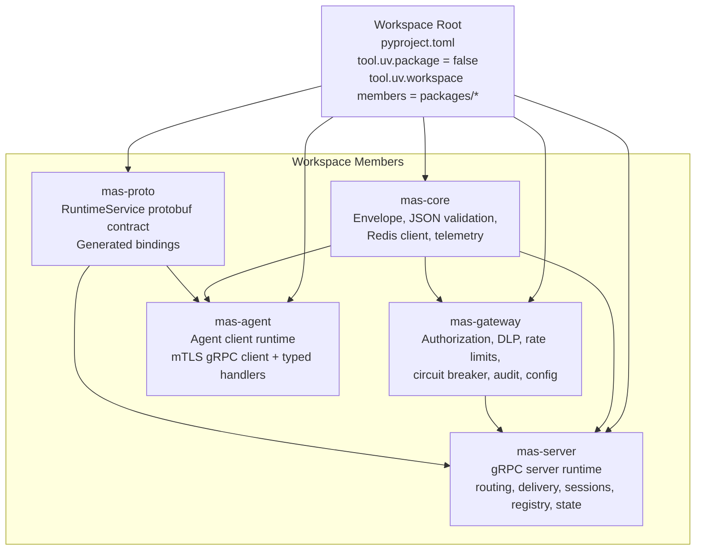
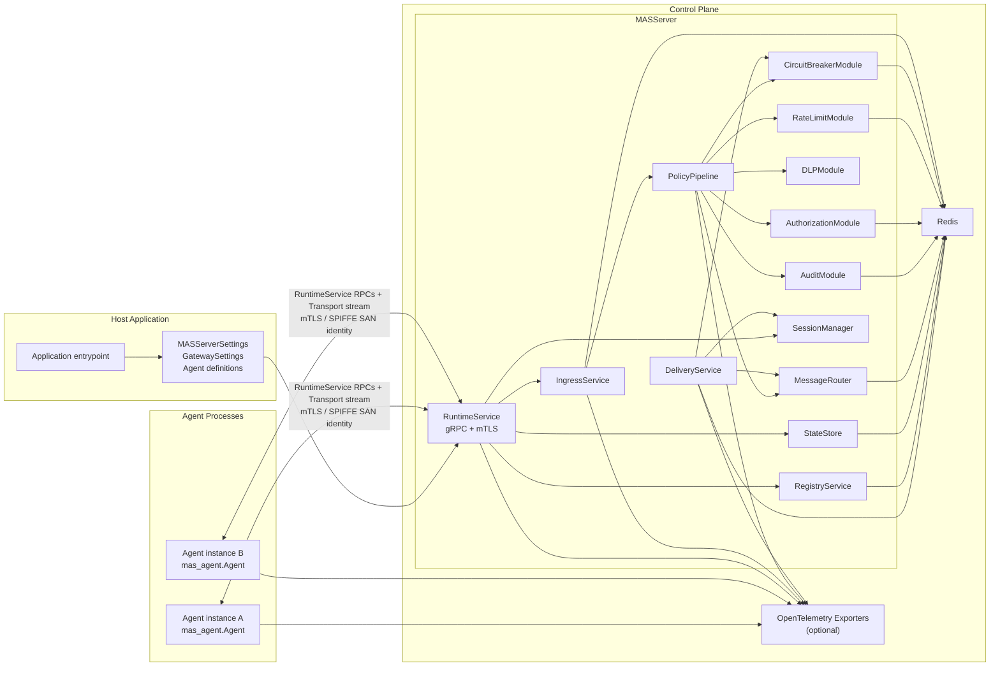
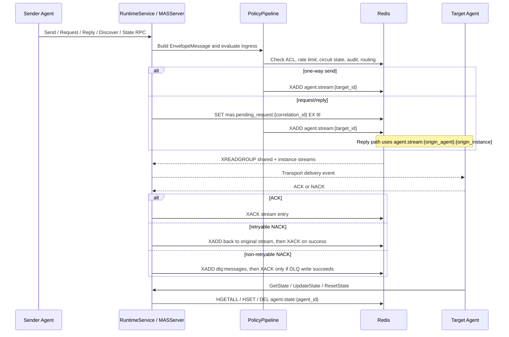
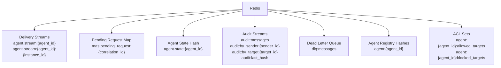

# Current Architecture

This document reflects the package-only MAS system in this repository.

## 1. Repository And Package Architecture

## 2. Runtime Topology

## 3. Data And Control Paths

## 4. Redis Data Model

## 5. Current System Boundaries

- Agents never connect to Redis directly.
- All inter-agent communication flows through `RuntimeService` on the MAS server over gRPC with mandatory mTLS.
- Agent identity is derived from the client certificate SPIFFE URI SAN: `spiffe://mas/agent/{agent_id}`.
- Authorization is deny-by-default and enforced server-side.
- Discovery is permission-scoped and only returns active allowlisted agents.
- Agent state is per logical `agent_id`, so multiple instances of the same agent share persisted state.
- Shared work distribution uses `agent.stream:{agent_id}` with Redis consumer groups.
- Replies are pinned to the requesting process using `agent.stream:{agent_id}:{instance_id}`.
- The workspace root is not a distributable package; installable artifacts are the individual workspace members.
