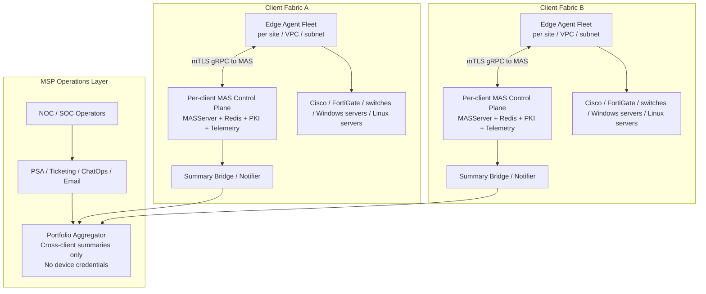
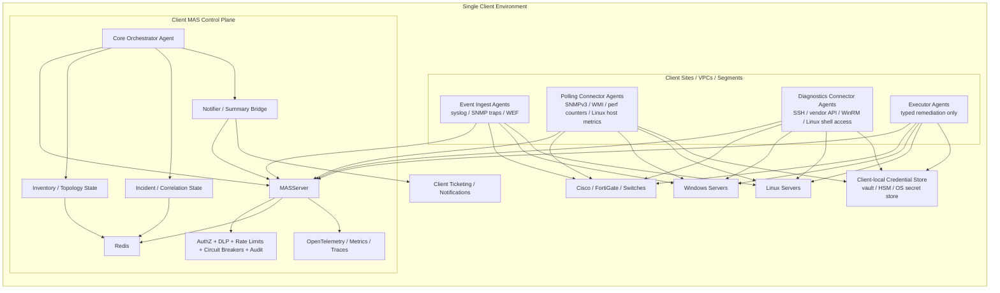
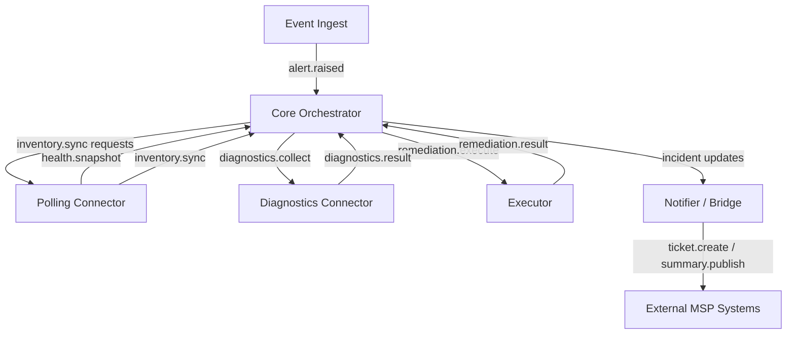
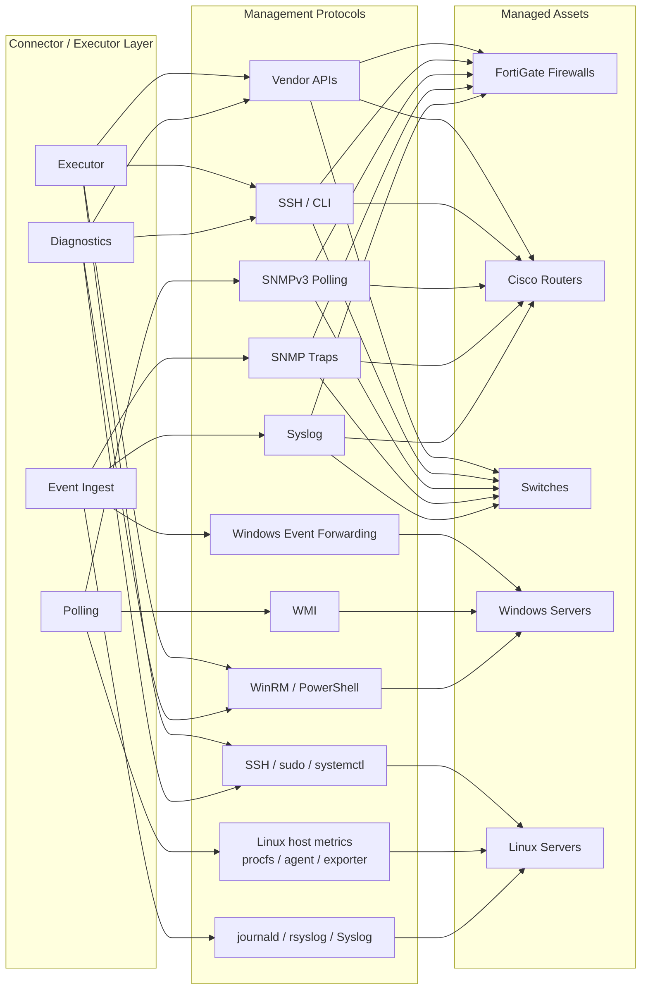
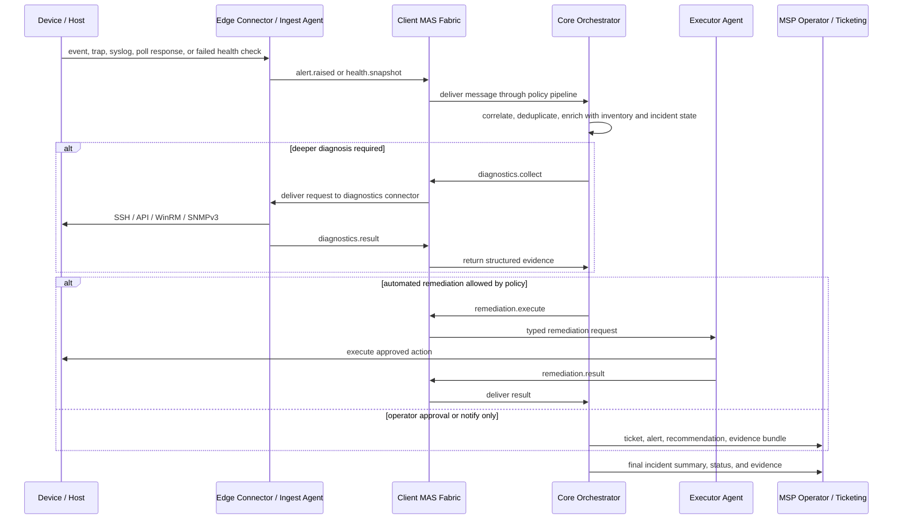
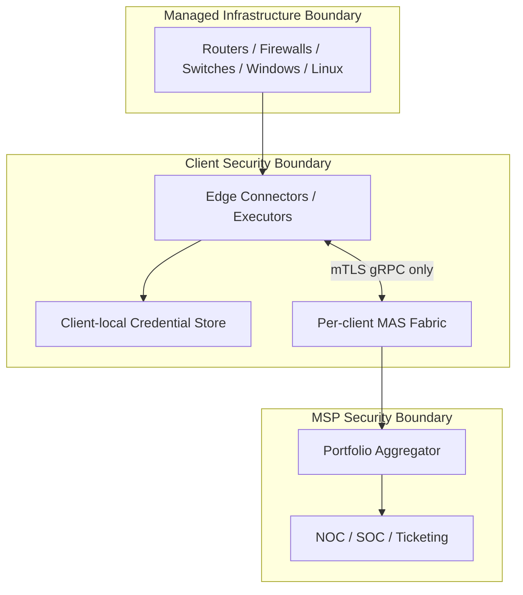

# Proposed MSP Architecture

This document describes the proposed managed-service-provider architecture we discussed for MAS.

It is a target system design, not the current repository implementation. It assumes the decisions we settled on earlier:

- one MAS fabric per client
- edge deployment inside each client environment
- automation allowed, but only through narrowly scoped executor agents
- MAS remains the secure control plane
- device and host protocol integrations live in connector/executor layers on top of MAS
- network infrastructure is the first optimization target, with Windows and Linux support following the same model

## 1. Recommended MSP Topology

## 2. Per-Client Fabric

## 3. Logical Agent Roles

## 4. External Protocol Surfaces

## 5. Incident, Diagnosis, And Remediation Flow

## 6. Trust Boundaries

## 7. Security Properties

- Each client gets its own MAS fabric, Redis instance, certificate authority or trust domain, and edge agent fleet.
- Device credentials remain inside the client boundary and are resolved locally by connector and executor agents.
- MAS messages carry references and structured instructions, not raw credential material.
- Executors are separate from collectors so read paths and write paths can be authorized independently.
- The MSP portfolio layer receives normalized summaries, incidents, and evidence metadata only; it does not hold live device credentials or direct device reachability.
- All automation passes through MAS policy controls: allowlists, DLP, audit, rate limits, and circuit breakers.

## 8. Operational Defaults

- Realtime intake should prefer push where available: syslog, SNMP traps, and Windows event forwarding.
- Baseline health should use periodic polling: SNMPv3 for network devices, WMI/performance counters for Windows, and Linux host metrics for Linux systems.
- Deep diagnostics should be on-demand through dedicated diagnostics connectors.
- Linux management should use dedicated diagnostics and executor paths for service state, package health, disk, memory, process, and log investigation, typically via SSH plus constrained sudo/systemctl access.
- Remediation should be typed and narrow, not arbitrary shell execution.
- Cross-client oversight should happen above the tenant fabrics through a summary bridge or portfolio aggregator, not by flattening all clients into one MAS control plane.
